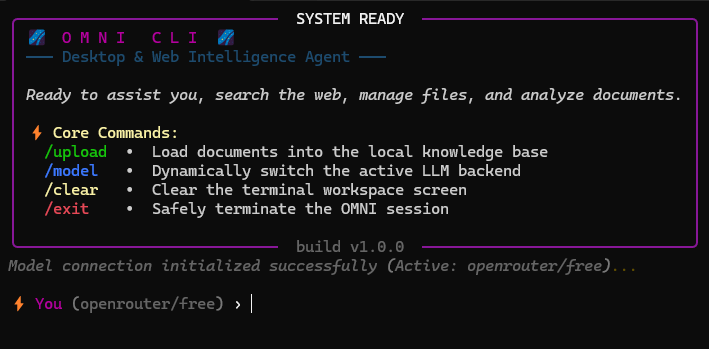

# Open Agents / OMNI

OMNI is a terminal-based AI assistant built with Python, LangChain and local vector search. It helps you to query the web, search your local document knowledge base, summarize findings, and export notes to Markdown or PDF.

## Screenshot



## Key Features

- AI chat workflow with tool-first reasoning
- OpenRouter cloud model support
- Local Ollama model support
- Web search using DuckDuckGo
- Web page text extraction for source-backed research
- Local knowledge base using ChromaDB and embeddings
- Document ingestion from external resources
- Markdown export and PDF conversion
- Interactive terminal interface with Rich styling

## Tech Stack

- Python
- LangChain 
- Ollama
- OpenRouter / OpenAI-compatible APIs
- ChromaDB
- DuckDuckGo Search
- Trafilatura
- Rich terminal UI
- WeasyPrint

## Project Structure

- `main.py` – app entry point and interactive terminal loop
- `agent.py` – model creation and agent builder logic
- `utils/general_search.py` – web search tool
- `utils/open_links.py` – article/text extraction tool
- `utils/create_rag.py` – ChromaDB knowledge base creation and search
- `utils/write_file.py` – Markdown and PDF export tools
- `chroma_db/` – persistent local vector database storage
- `GTK3-Runtime Win64/` – bundled GTK runtime used for Windows compatibility

## How It Works

1. The app starts an interactive chat session in the terminal.
2. The agent chooses tools based on the user query.
3. It searches the local vector database first when a relevant collection exists.
4. If needed, it runs a web search and extracts content from matching pages.
5. It answers with cited reasoning and can save the results to files.

## Commands

The app exposes these terminal commands:

- `/upload` – create or refresh a local knowledge base from a source document
- `/model` – switch between OpenRouter and Ollama
- `/clear` – clear the terminal interface
- `/exit` – exit the session

## Quick Start

### 1. Install dependencies

Use the project configuration in `pyproject.toml`:

```bash
uv pip install -r requirements.txt
```

If you want to use the local Ollama model, make sure Ollama is installed and the model is available:

```bash
ollama pull llama3.1:latest
```

### 2. Configure your environment

Create a `.env` file in the project root with your key if using OpenRouter:

```env
OPEN_ROUTE_API_KEY=your_key_here
```

### 3. Run the app

```bash
uv run main.py
```

### 4. Use the assistant

Example prompt:

```text
Summarize the key ideas from my uploaded documents.
```

or

```text
Research the latest developments in AI agents and tell me the most important trends.
```

## Supported Usage Patterns

- Research and summarize web content
- Ground answers in locally uploaded documents
- Save notes as Markdown files
- Convert Markdown notes to PDF
- Manage multiple Chroma collections for different domains

## Notes

- The project is optimized for Windows execution in this repository, including the bundled GTK runtime used by some export tools.
- Local knowledge base features depend on the `chroma_db` directory being available and writable.
- The app purposely prefers local retrieval before external web search when it can answer from indexed documents.

## License

This project is currently provided as a local research/demo project without a formal license file. If you plan to redistribute it, add a license before publication.
